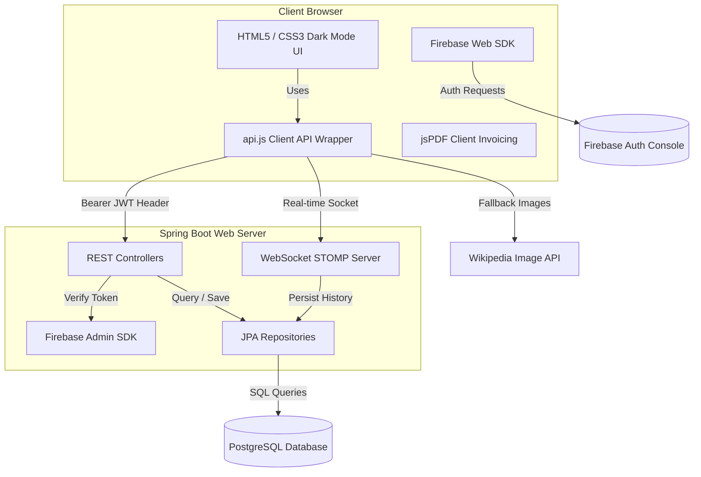

# Agro Linken Smart Ecosystem — Development & Implementation Summary

> This document provides a comprehensive overview of the design architecture, completed implementation phases, database model enhancements, and optimization efforts executed on the **Agro Linken** platform.
> 
> For the full system architecture diagram, see [`docs/architecture/ARCHITECTURE.md`](../architecture/ARCHITECTURE.md).  
> For the REST API reference, see [`docs/api/API.md`](../api/API.md).

---

## 🏗️ System Architecture

The Agro Linken platform is built as a split-client architecture containing a performant Java Spring Boot backend and an elegant, dependency-free vanilla HTML5/CSS3/JavaScript frontend.



---

## 📅 Chronological Development Phases

| Phase / Focus | Key Accomplishments | Impact & Benefits |
| :--- | :--- | :--- |
| **Phase 1: Foundation & Roles** | Created `Review` and `Notification` entities. Expanded `User` roles from simple Buyers and Farmers to include Administrators and Transporters. | Established the data schema foundation and role-based access control. |
| **Phase 2: WebSocket & Forums** | Configured STOMP WebSocket endpoints (`/ws-chat`), WebSocket controllers, and created database mappings for the community forum. | Enabled true real-time communication between users without page refreshes. |
| **Phase 3: UI Overhaul & Dark Mode** | Overhauled all HTML files to a premium dark-mode sidebar layout. Implemented interactive feeds for Schemes, Reviews, and WebSocket Chat. | Transformed the app from a simple prototype into a modern, production-grade interface. |
| **Phase 4: Ledgers & Subscriptions** | Implemented the digital Credit Ledger (`CreditRecord`) and dynamic Crop Price Subscription Alerts (`CropSubscription`). | Provided farmers with direct access to credit booking and real-time market notifications. |
| **Phase 5: Transporter Logistics** | Created the bidding system (`DeliveryBid`), transporter profile setups, Cash-on-Delivery payment options, and client-side PDF tax invoice generation. | Provided a complete supply-chain circle connecting farmers, transporters, and buyers. |
| **Performance & Stability** | Migrated DB to PostgreSQL. Optimized indexes, converted in-memory queries to SQL, resolved N+1 query loops, and resolved Render free-tier cold-starts. | Reduced page load times, resolved backend crashes, and secured high Render hosting stability. |

---

## 🛠️ Detailed Component Overhaul

### 1. Spring Boot Backend Services
* **WebSocket Integration**: Configured `WebSocketConfig.java` to support standard STOMP endpoints on `/ws-chat`, allowing `ChatController.java` to handle `/app/chat.sendMessage` mappings.
* **Firebase Admin Integration**: Configured `FirebaseConfig.java` to dynamically load private key configurations (`serviceAccountKey.json` or `FIREBASE_CREDENTIALS` env variable) to authenticate tokens.
* **Digital Udhar (Credit) Book**: Created `CreditController.java` and `CreditRecord.java` to track pending user credit, providing full transaction history and balances.
* **Auto-Healing Authentication**: Added logic to `UserController.java` that automatically links a Firebase user with an existing local database record by email, and extracts custom names from the email prefix if the profile name is blank.
* **DB Constraint Correction**: Added SQL runtimes to drop stale DB constraints (such as `users_role_check`) to permit role migrations dynamically on database restart.

### 2. Frontend Overhaul (Vanilla HTML5 / CSS3 / JS)
* **Premium Dark Mode System**: Created global variables in `styles/main.css` implementing beautiful gradients, card designs, responsive sidebars, status chips, and smooth hover micro-animations.
* **Dynamic AI-Driven Images**: Integrated Wikipedia API image fetching into `api.js`. The marketplace queries Wikipedia for crop definitions (e.g., "Tomato") and falls back to Unsplash photo cards, completely removing plain text/emoji placeholders.
* **PDF Bill Generator**: Integrated `jspdf` into `dashboard.html` allowing Buyers and Farmers to download structured tax invoices containing buyer/farmer details, transaction tables, and grand totals directly from their browser.
* **Transporter Logistics Bidding**: Created vehicle profiles, bid grids, and dynamic action buttons so transporters can view shipments, bid on shipments, and track accepted trips.

### 3. Database Schema (PostgreSQL)
Below is the structural breakdown of the enhanced relational schema:

```
[User] ──(1)─────────────(N)── [Product] ──(1)───────────(N)── [Review]
  │                                │
 (1)                              (1)
  │                                │
 (N)                              (N)
[CreditRecord]                 [Order] ──(1)─────────────(N)── [DeliveryBid]
```

* **`users` Table**: Optimized with indexes on `firebase_uid`, `email`, and `phone` for sub-millisecond session authentication.
* **`orders` Table**: Expanded to map delivery statuses (`PENDING`, `ACCEPTED`, `SHIPPED`, `DELIVERED`), store final payment methods (Cash on Delivery), and log active transporter locations.
* **`delivery_bids` Table**: Logs the transporter ID, order ID, bid amount, delivery timeline estimate, and approval status (`PENDING`, `ACCEPTED`, `REJECTED`).

---

## ⚡ Performance Optimizations

To address lag, query overhead, and hosting restrictions, the following optimization measures were deployed:

1. **JPA Query Optimization**:
   * Replaced Java Stream filtering in controllers with native database-level filters in `ProductRepository.java` using `@Query` containing conditional `NULL` checks.
2. **N+1 SQL Queries Resolved**:
   * Created a single aggregation endpoint `GET /api/reviews/summaries` that calculates average ratings and counts in one database request (`AVG(rating)` and `COUNT(r)`) grouped by product ID, rather than fetching reviews individually for every item on page load.
3. **Transactional Batch Operations**:
   * Annotated critical routes with `@Transactional`.
   * Swapped sequential loop saves (`.save()`) with single batch collection operations (`.saveAll()`) for transporter bidding rejections and crop notification dispatching.
4. **Debounced Search Inputs**:
   * Implemented a `debounce` helper (250ms delay) on search inputs in `marketplace.html` to eliminate excessive rendering loops during fast keystrokes.
5. **Render Deployment Stability**:
   * Created a custom `.dockerignore` to reduce compilation overhead.
   * Configured Docker JVM flags (`-Xmx350m`) to prevent container termination due to memory limit violations on free-tier Render plans.
6. **Network Reliability & Retries**:
   * Wrote a custom `fetchWithRetry` wrapper inside `api.js` using exponential backoff to handle Render free-tier server cold-starts, retrying 500/502/503/504 timeout codes up to 5 times.
