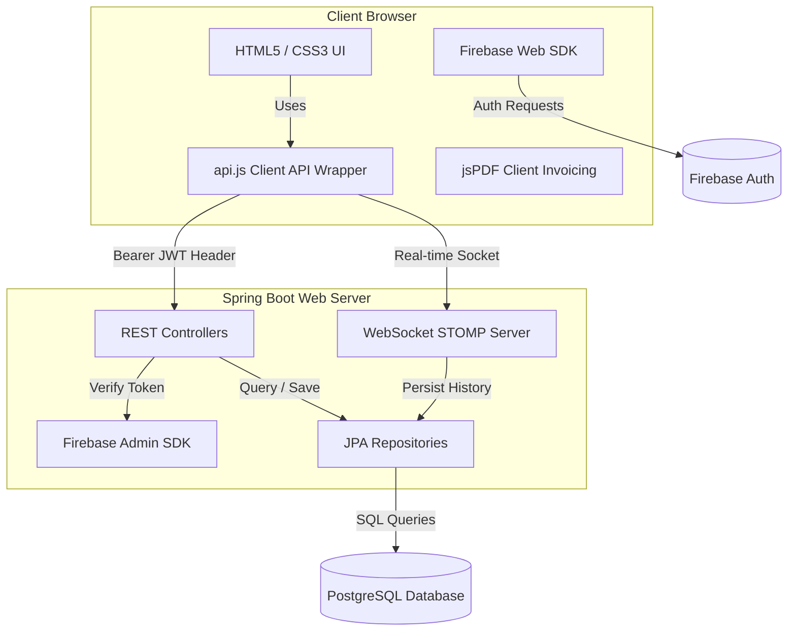

# Agro Linken — Development & Implementation Log

This document summarizes the development history, architectural design, database model enhancements, and performance optimizations made during the construction of the Agro Linken platform.

---

## Architecture Overview

Agro Linken uses a split-client architecture: a standalone Java Spring Boot REST API backend and a Vanilla HTML5/CSS3/JavaScript frontend.

---

## Development History

| Phase / Focus | Key Changes | Purpose |
|---|---|---|
| **Phase 1: Domain Entities & Roles** | Created `Review` and `Notification` entities. Expanded user roles (`FARMER`, `BUYER`, `SHOP_OWNER`, `TRANSPORTER`, `ADMIN`). | Define core domain schema and role model. |
| **Phase 2: WebSocket Messaging** | Implemented STOMP WebSocket endpoints (`/ws-chat`), `ChatController`, and `Message` database entity. | Enable real-time peer-to-peer messaging between buyers, farmers, and transporters. |
| **Phase 3: Frontend Layout Overhaul** | Redesigned frontend to a dark-theme dashboard layout with responsive sidebars and structured views for all roles. | Improve user navigation and multi-role UX. |
| **Phase 4: Ledgers & Subscriptions** | Implemented digital Credit Ledger (`CreditRecord`) and dynamic Crop Price Alert subscriptions (`CropSubscription`). | Allow tracking of rural credit transactions and user alerts for produce categories. |
| **Phase 5: Logistics Bidding** | Implemented transporter bidding system (`DeliveryBid`), vehicle profile attributes, and client-side PDF tax invoice generation. | Complete logistics workflow connecting farmers, transporters, and buyers. |
| **Database & Deployment** | Migrated from H2 in-memory DB to PostgreSQL. Configured Docker build and memory tuning for Render deployment. | Move to persistent relational storage and cloud hosting. |

---

## Backend Implementation Details

### 1. WebSocket Integration
- `WebSocketConfig.java` registers standard STOMP endpoints on `/ws-chat`.
- `ChatController.java` routes messages from `/app/chat.sendMessage` to subscriber topics `/topic/messages/{roomId}` and persists chat history into PostgreSQL via `MessageRepository`.

### 2. Authentication & Auto-Registration
- `UserController.java` verifies incoming Firebase JWT tokens on protected routes via Firebase Admin SDK.
- To handle user creation seamlessly upon first sign-in, auto-registration logic creates a local database record if the Firebase UID or email is not yet registered.

### 3. PostgreSQL Database Schema
- **`users` Table**: Contains user profiles, roles, contact info, and transporter vehicle specs (`vehicle_type`, `vehicle_number`, `vehicle_capacity`).
- **`products` Table**: Produce listings linked to a farmer `User`.
- **`orders` Table**: Manages status lifecycle (`PENDING` → `ACCEPTED` → `SHIPPED` → `DELIVERED`), assigned transporter ID, payment mode, and location tracking strings.
- **`delivery_bids` Table**: Tracks freight quotes submitted by transporters for orders, including bid amount and estimated transit time.
- **`credit_records` Table**: Maintains Udhar credit balances (credit purchases vs repayments) for farmers and shop owners.

---

## Performance & Optimization Notes

1. **Database Querying**:
   - Replaced in-memory stream filtering with database-level query parameters in `ProductRepository` using custom JPQL queries with null checks (`:query IS NULL OR LOWER(p.name) LIKE ...`).
   - Grouped review statistics into a single SQL query (`GET /api/reviews/summaries`) returning `AVG(rating)` and `COUNT(r)` by product ID.

2. **Network Resilience**:
   - Implemented an automatic retry wrapper (`fetchWithRetry`) in `api.js` using exponential backoff to handle Render free-tier cold-start latencies gracefully.

3. **Deployment Memory Constraints**:
   - Configured Docker execution with JVM heap limits (`-Xmx350m -Xms256m`) to ensure execution within Render's free tier memory bounds.
